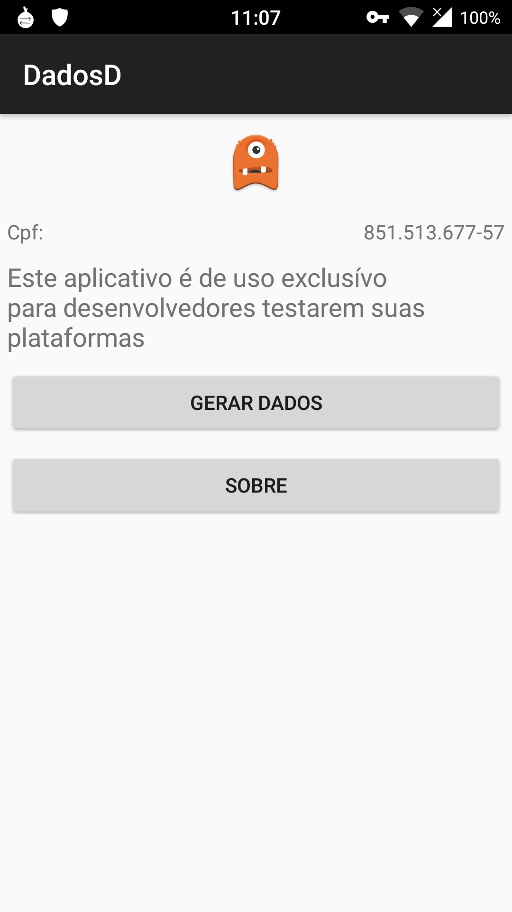

# DadosD 

#### Info Básica

DadosD é um aplicativo para Android com o objetivo de facilitar a sua vida como desenvolvedor de aplicativos ou páginas web. Utilizando este aplicativo você poderá gerar números de CPF válidos para testar seu algortimo de validaćão de CPF.

#### O que foi implementado

  * Gerando número de CPF aleatório e copiando este para a área de transferência.

#### Screenshots

#### Links

#### Contato

Para qualquer dúvida, erros ou sugestões nos envie uma mensagem.

#### Time DadosD

##### Desenvolvedores

Thiago Ribeiro Mendes 

##### Agradecimentos

Icone provido por [OpenClipArt](https://openclipart.org/detail/167774/monsternoshadow) CC

# Licenća

    Copyright 2015-2016 The DadosD Project Team

    This program is free software; you can redistribute it and/or
    modify it under the terms of the GNU General Public License
    as published by the Free Software Foundation; either version 3
    of the License, or (at your option) any later version.

    https://www.gnu.org/licenses/gpl-3.0.html

    This program is distributed in the hope that it will be useful,
    but WITHOUT ANY WARRANTY; without even the implied warranty of
    MERCHANTABILITY or FITNESS FOR A PARTICULAR PURPOSE.  See the
    GNU General Public License for more details.
 
    You should have received a copy of the GNU General Public License
    along with this program.  If not, see <http://www.gnu.org/licenses/>.
    
